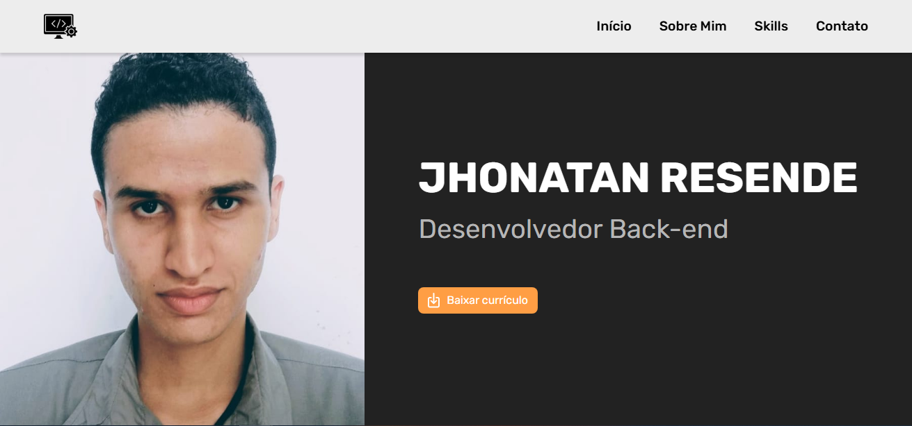

# 🌐 Portfólio - Jhonatan Resende

Site pessoal desenvolvido para apresentar minhas habilidades, projetos e formas de contato como desenvolvedor.



---

## 🚀 Sobre o projeto

Portfólio institucional com layout moderno e responsivo, criado para reforçar minha presença online como desenvolvedor Back-end.

O objetivo é aplicar conceitos fundamentais de desenvolvimento web, como estruturação semântica, responsividade e boas práticas de CSS.

---

## 🛠️ Tecnologias utilizadas

- HTML5
- CSS3 (Flexbox, Media Queries)

---

## 📱 Responsividade

O site foi desenvolvido com foco em diferentes tamanhos de tela, garantindo boa experiência em:

- 📱 Smartphones
- 💻 Desktops
- 📟 Tablets

---

## 🎯 Funcionalidades

- Navegação entre seções (Início, Sobre, Skills, Contato)
- Layout responsivo
- Links para redes sociais
- Download de currículo

---

## ▶️ Como rodar o projeto

```bash
# Clone o repositório
git clone https://github.com/JhonatanResende/Portfolio.git

# Acesse a pasta do projeto
cd Portfolio

# Abra o index.html no navegador
# ou use a extensão Live Server no VS Code
```

---

## 🔗 Acesse o projeto

👉 https://jhonatanresende.github.io/Portfolio/

---

## 📬 Contato

- LinkedIn: https://www.linkedin.com/in/jhonatanresende/
- GitHub: https://github.com/jhonatanresende

---

## 📌 Status do projeto

🚧 Em evolução — melhorias visuais e novas funcionalidades podem ser adicionadas futuramente.

---

## 💡 Aprendizados

Durante o desenvolvimento deste projeto, pratiquei:

- Estruturação de páginas com HTML semântico
- Estilização com CSS moderno
- Organização de layout com Flexbox
- Criação de responsividade para múltiplos dispositivos

---

## 📄 Licença

Este projeto está sob a licença MIT.
